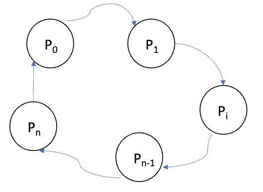
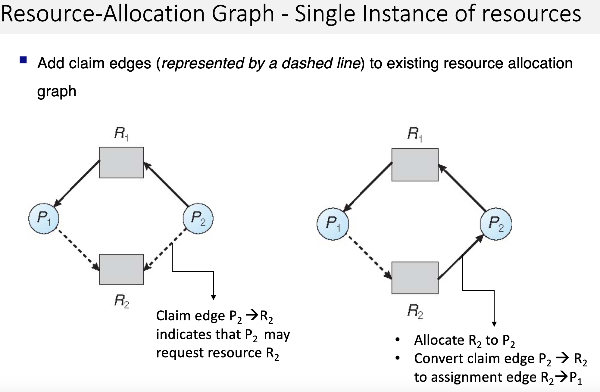
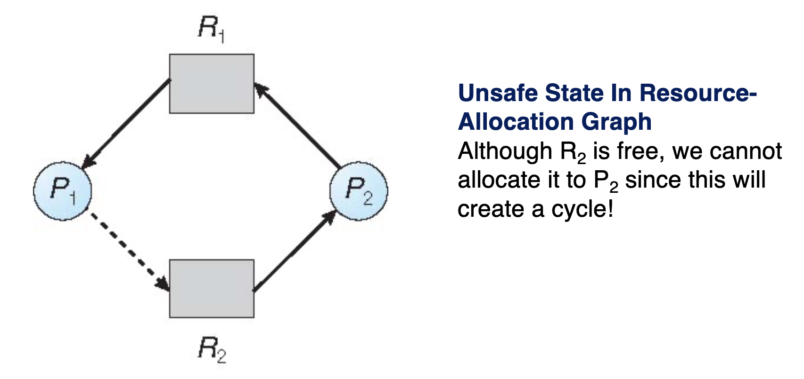
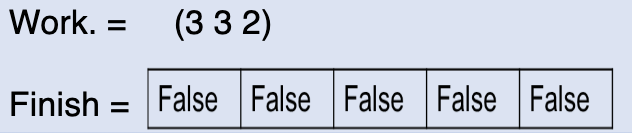
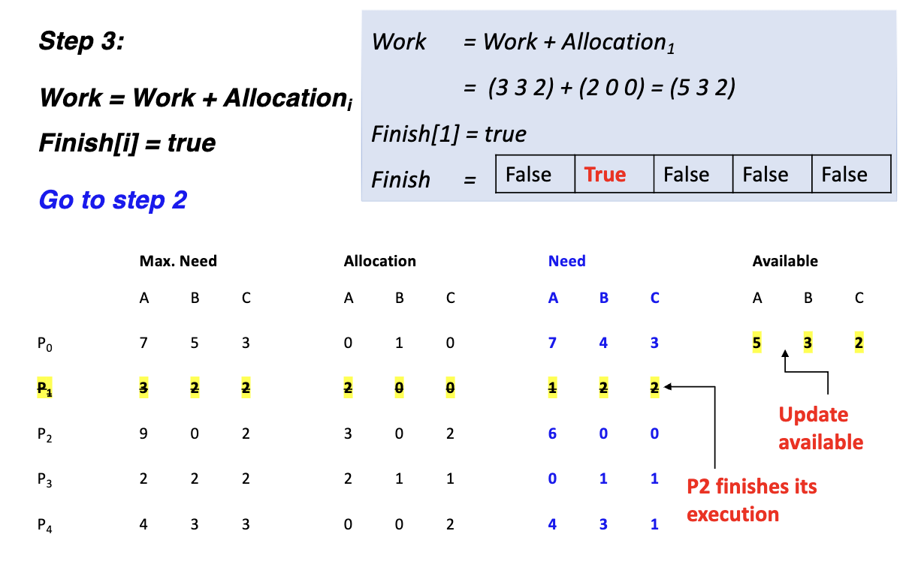
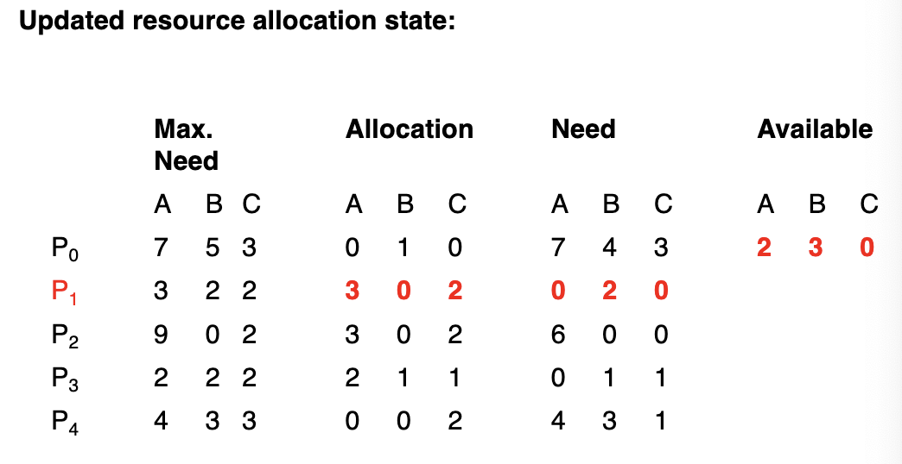
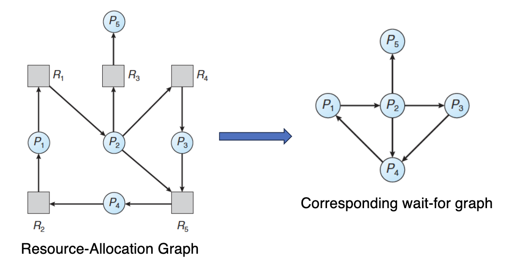
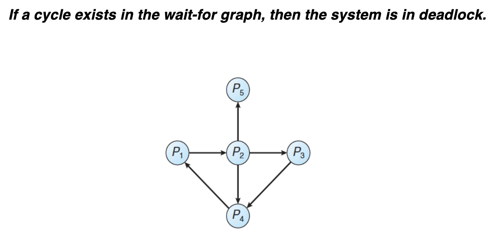

# Chapter 8: Deadlocks

<!--toc:start-->

- [Chapter 8: Deadlocks](#chapter-8-deadlocks)
  - [1. System Model](#1-system-model)
  - [2. How Deadlock Occurs](#2-how-deadlock-occurs)
  - [3. Deadlock Characterization](#3-deadlock-characterization)
  - [4. Resource Allocation in Systems](#4-resource-allocation-in-systems)
  - [5. Methods for Handling Deadlocks](#5-methods-for-handling-deadlocks)
  - [6. Deadlock Avoidance Strategy](#6-deadlock-avoidance-strategy)
    - [Example for Deadlock Avoidance Strategy:](#example-for-deadlock-avoidance-strategy)
  - [7. Safe and Unsafe States](#7-safe-and-unsafe-states)
  - [8.1 Single Instance of a Resource Type](#81-single-instance-of-a-resource-type)
  - [8.2 Banker's Algorithm (For Multiple Instances of a Resource Type)](#82-bankers-algorithm-for-multiple-instances-of-a-resource-type)
    - [Overview:](#overview)
    - [Key Concepts:](#key-concepts)
    - [Data Structures Used in the Banker’s Algorithm:](#data-structures-used-in-the-bankers-algorithm)
    - [Example for Banker's Algorithm:](#example-for-bankers-algorithm)
    - [Part 1: Safety Algorithm](#part-1-safety-algorithm)
    - [Part 2: Resource-Request Algorithm](#part-2-resource-request-algorithm)
    - [Example for Resource-Request in Banker's Algorithm](#example-for-resource-request-in-bankers-algorithm)
  - [9.1 Deadlock Detection for a Single Instance of a Resource Type](#91-deadlock-detection-for-a-single-instance-of-a-resource-type)
  - [9.2 Deadlock Detection Algorithm](#92-deadlock-detection-algorithm-for-multiple-instances-of-a-resource-type)
    - [Overview:](#overview)
    - [Data Structures for Detection Algorithm:](#data-structures-for-detection-algorithm)
    - [Algorithm Steps:](#algorithm-steps)
    - [Example for Deadlock Detection Algorithm:](#example-for-deadlock-detection-algorithm)
    - [Example for Deadlock Detection: Case of Additional Request](#example-for-deadlock-detection-case-of-additional-request)
  - [10. Recovery from Deadlock](#10-recovery-from-deadlock)
  <!--toc:end-->

## 1. System Model

- **Resources in a system**:
  - A system consists of various **resources**, which can be CPU cycles, memory space, or I/O devices.
  - **Resource types**: $R_1, R_2, \dots, R_m$, where each type $R_i$ has $W_i$ instances.
  - Example: A system may have two instances of a printer.
- **Process utilization of resources**:
  1. **Request**: A process requests a resource.
  2. **Use**: The process uses the resource.
  3. **Release**: The process releases the resource after usage.
- If resources are unavailable, the process enters a **waiting state**.

---

## 2. How Deadlock Occurs

- **Definition**: A deadlock occurs when a process is waiting for a resource that is held by another waiting process.
- In a deadlock, processes never finish executing, and system resources are tied up, preventing other processes from starting.

---

## 3. Deadlock Characterization

Deadlock occurs when all of the following conditions hold simultaneously:

1. **Mutual Exclusion**: Only one process can use a resource at a time.
2. **Hold and Wait**: A process holding at least one resource is waiting to acquire additional resources held by other processes.
3. **No Preemption**: Resources can only be released voluntarily by the process holding them.
4. **Circular Wait**: There exists a set of waiting processes $\{P_0, P_1, \dots, P_n\}$ such that $P_0$ is waiting for a resource held by $P_1$, $P_1$ is waiting for a resource held by $P_2$, ..., and $P_n$ is waiting for a resource held by $P_0$.

---

## 4. Resource Allocation in Systems

- **Graph representation**:

  - **Resource-Allocation Graph**: A directed graph $G = (V, E)$, where:
    - $V = P \cup R$:
      - $P = \{P_1, P_2, \dots, P_n\}$ are processes.
      - $R = \{R_1, R_2, \dots, R_m\}$ are resource types.
    - **Edges**:
      - **Request edge**: $P_i \to R_j$ indicates that process $P_i$ has requested resource $R_j$.
      - **Assignment edge**: $R_j \to P_i$ indicates that resource $R_j$ is assigned to process $P_i$.

- **Basic facts**:
  - If the graph contains no cycles, **no deadlock** is present.
  - If the graph contains a cycle, deadlock is possible, depending on whether there is one or multiple instances per resource type.

---

## 5. Methods for Handling Deadlocks

Three primary methods are used to handle deadlocks:

1. **Deadlock Prevention**: Ensures that at least one of the four necessary conditions (from Section 3) cannot hold.
   - Practically, only the **circular wait condition** can be prevented effectively.
2. **Deadlock Avoidance**:
   - The OS is given additional information about the resources a process will request in advance.
   - The OS uses this information to determine if it can allocate resources without entering a deadlock.
3. **Deadlock Detection**:
   - The system is allowed to enter a deadlock state, and mechanisms are used to detect and recover from it.

Most modern operating systems (e.g., UNIX, Linux, Windows) **ignore deadlocks** and let them occur, using other strategies to recover.

---

## 6. Deadlock Avoidance Strategy

- The **OS requires additional information** about the resources a process may need, including the **maximum number** of resources.
- The **resource-allocation state** is continually examined to ensure no circular-wait condition occurs.

### Example for deadlock avoidance strategy:

Consider a system with a single resource type (e.g., magnetic tapes) and 12 total instances:

- **Process P0** has a maximum need of 10 tapes, and currently holds 5.
- **Process P1** has a maximum need of 4 tapes, and currently holds 2.
- **Process P2** has a maximum need of 9 tapes, and currently holds 2.

If the system is in a **safe state**, it means that the processes can finish in some sequence without causing deadlock.

---

## 7. Safe and Unsafe States

- **Safe State**: The system is safe if there exists a sequence of processes such that each process can be allocated its required resources without entering a deadlock.
- **Unsafe State**: If the system is not safe, deadlock may occur.

The OS checks each time a process requests resources to determine whether granting the request will leave the system in a safe state.

---

## 8.1 Single Instance of a Resource Type

Use a Resource-Allocation Graph where claim edges are added (represented by dashed lines) to an existing resource allocation graph

The request **will only be granted** if converting the request edge to an assignment edge does not result in a formation of a cycle (deadlock).

---

## 8.2 Banker's Algorithm (For Multiple Instances of a Resource Type)

### Overview:

- The **Banker’s Algorithm** ensures safe resource allocation for systems with multiple instances of each resource type.
- The algorithm works in two parts:
  1. **Safety Algorithm**: Checks if the system is in a safe state.
  2. **Resource-Request Algorithm**: Checks if a process's request for resources can be satisfied without leading to an unsafe state.

### Key Concepts:

- **Maximum Use**: Each process declares its maximum resource needs upfront.
- **Finite Duration**: When a process acquires all its resources, it must return them in a finite amount of time.
- **Request Waiting**: If a process requests resources, it may need to wait if the system cannot safely allocate them.

### Data Structures Used in the Banker’s Algorithm:

- **Available**: A vector of length $m$, where $\text{Available}[j]$ is the number of available instances of resource type $R_j$.
- **Max**: An $n \times m$ matrix, where $\text{Max}[i,j]$ represents the maximum number of instances of resource $R_j$ that process $P_i$ may request.
- **Allocation**: An $n \times m$ matrix, where $\text{Allocation}[i,j]$ is the number of instances of resource $R_j$ currently allocated to process $P_i$.
- **Need**: An $n \times m$ matrix, where $\text{Need}[i,j]$ is the number of additional instances of resource $R_j$ process $P_i$ needs to complete its task.

  $\text{Need}[i,j] = \text{Max}[i,j] - \text{Allocation}[i,j]$

### Example for Banker's Algorithm:

- **System**: 5 processes $P_0$ to $P_4$, with 3 resource types: A (10 instances), B (5 instances), C (7 instances).
- **Initial State**:

| Process | Max Need (A B C) | Allocation (A B C) | Available (A B C) |
| ------- | ---------------- | ------------------ | ----------------- |
| P0      | 7 5 3            | 0 1 0              | 3 3 2             |
| P1      | 3 2 2            | 2 0 0              |                   |
| P2      | 9 0 2            | 3 0 2              |                   |
| P3      | 2 2 2            | 2 1 1              |                   |
| P4      | 4 3 3            | 0 0 2              |                   |

- **Need Matrix** (calculated as Max Need - Allocation):

| Process | Need (A B C) |
| ------- | ------------ |
| P0      | 7 4 3        |
| P1      | 1 2 2        |
| P2      | 6 0 0        |
| P3      | 0 1 1        |
| P4      | 4 3 1        |

---

### Part 1: Safety Algorithm

- **Step 1**: Initialize **Work** = Available, **Finish** = false for all processes.
  
- **Step 2**: Find a process $P_i$ such that:
  - $\text{Finish}[i] = \text{false}$
  - $\text{Need}_i \leq \text{Work}$
  - If no such process exists, go to Step 4.
- **Step 3**: Allocate resources to $P_i$:
  - $\text{Work} = \text{Work} + \text{Allocation}_i$
  - Set $\text{Finish}[i] = \text{true}$, and repeat from Step 2.
    Example:
    
- **Step 4**: If all processes are finished, the system is in a **safe state**.
  We can see that process $P_3$, $P_4$, $P_2$, and $P_0$, all satisfy the conditions in step 2.

  In short, our goal with safety algorithm is to "go all the way" and find out whether our decision of allocating resources to a certain process will lead to a deadlock. Therefore, instead of allocating some resources we straight away allocate the max need of a process (simulating the worst-case scenario where the process decides to access its max need immediately) and then check if this could lead to a deadlock in the future or not.

---

### Part 2: Resource-Request Algorithm

- **Step 1**: If $\text{Request}_i \leq \text{Need}_i$, proceed; otherwise, raise an error since a process' need can't exceed the maximum claim.
- **Step 2**: If $\text{Request}_i \leq \text{Available}$, proceed; otherwise, $P_i$ must wait.
- **Step 3**: Pretend to allocate requested resources and update the system state:

  - $\text{Available} = \text{Available} - \text{Request}_i$

  - $\text{Allocation}_i = \text{Allocation}_i + \text{Request}_i$
  - $\text{Need}_i = \text{Need}_i - \text{Request}_i$
  - Run the **safety algorithm** to check if the system is still in a safe state. If yes, allocate the resources; if no, revert to the previous state, and $P_i$ must wait.

### Example for Resource-Request in Banker's Algorithm:

- $P_1$ requests resources (1 0 2)
- Check if $\text{Request}_1$ $\leq$ $\text{Need}_1$:
  $\newline$ (1 0 2) $\leq$ (3 3 2) $\implies$ true
- Pretend resources requested get granted
- Update the $\text{Max}_1$, $\text{Allocation}_1$ and $\text{Need}_1$
  - $\text{Available}_1$ = (3 3 2) - (1 0 2) = (2 3 0)
  - $\text{Allocation}_1$ = (2 0 0) + (1 0 2) = (3 0 2)
  - $\text{Need}_1$ = (1 2 2) - (1 0 2) = (0 2 0)

---

## 9.1 Deadlock Detection for a Single Instance of a Resource Type

In the case where we have a single instance for a resource type, we can simply use a **wait-for graph**.

- It's a variant of the resource-allocation graph if all resources have only a **single instance** used for deadlock detection
- By abstracting the resource block from a resource-allocation graph, we get a **wait-for graph**.
- Each node is a process, and an edge from $P_i \rightarrow P_j$ in the **wait-for graph** implies that $P_i$ is waiting for $P_j$ to release that resource since it needs it.

---

## 9.2 Deadlock Detection Algorithm (For Multiple Instances of a Resource Type)

### Overview:

- Unlike avoidance, detection allows the system to enter a deadlock state and uses an algorithm to identify and recover from deadlock.

### Data Structures for Detection Algorithm:

- **Available**: A vector of available resources for each type.
- **Allocation**: An $n \times m$ matrix of currently allocated resources.
- **Request**: An $n \times m$ matrix where $\text{Request}[i,j]$ indicates how many resources process $P_i$ is currently requesting.

### Algorithm Steps:

1. **Initialize**:
   - $\text{Work} = \text{Available}$
   - $\text{Finish}[i] = \text{false}$ for all processes where $\text{Allocation}_i \neq 0$. Otherwise Finish[i] = true.
2. Find an index $i$ such that:
   - $\text{Finish}[i] = \text{false}$
   - $\text{Request}_i \leq \text{Work}$
   - If no such index exists, go to Step 4.
3. Allocate resources to $P_i$, update:
   - $\text{Work} = \text{Work} + \text{Allocation}_i$
   - Set $\text{Finish}[i] = \text{true}$, and repeat from Step 2.
4. If $\text{Finish}[i] = \text{false}$ for some $i$, the system is in a deadlocked state. $P_i$ is deadlocked.

---

### Example for Deadlock Detection Algorithm:

- **System**: 5 processes $P_0$ to $P_4$, with 3 resource types: A (7 instances), B (2 instances), C (6 instances).
- **Initial State**:

| Process | Allocation (A B C) | Request (A B C) | Available (A B C) |
| ------- | ------------------ | --------------- | ----------------- |
| P0      | 0 1 0              | 0 0 0           | 0 0 0             |
| P1      | 2 0 0              | 2 0 2           |                   |
| P2      | 3 0 3              | 0 0 0           |                   |
| P3      | 2 1 1              | 1 0 0           |                   |
| P4      | 0 0 2              | 0 0 2           |                   |

**Step 1:**

- Work = Available = (0 0 0)
  Since $\text{Allocation}_1$ $\neq$ 0, for all i $\in$ [1, n]
  Finish = [false, false, false, false, false]

**Step 2:**

- Find an index i such that both:

  1. Finish[i] = false
  2. Request $\leq$ Work

  If no such i exists, go to step 4

If the above two conditions are satisfied, we assume that the work has been done and the allocated resources can now be freed.

Therefore, if we find a case where Finish[i] = false and Request $\leq$ Work, then we assume we had granted those resources and can proceed to freeing them.

Thus we find that

- $P_0$ satisfies the aforementioned two conditions i.e. $\text{Request}_i \leq \text{Work}$ and Finish[i] = false, so resources are allocated, and $\text{Finish}[0] = \text{true}$.
- The system is not in deadlock, as the sequence $<P_0, P_2, P_3, P_1, P_4>$ satisfies the safety condition.

### Example for Deadlock Detection: Case of Additional Request

Suppose $P_2$ requests another additional instance of type C.

| Process | Allocation (A B C) | Request (A B C) | Available (A B C) |
| ------- | ------------------ | --------------- | ----------------- |
| P0      | 0 1 0              | 0 0 0           | 0 0 0             |
| P1      | 2 0 0              | 2 0 2           |                   |
| P2      | 3 0 3              | 0 0 1           |                   |
| P3      | 2 1 1              | 1 0 0           |                   |
| P4      | 0 0 2              | 0 0 2           |                   |

In this case we can see for Process $P_0$, $\text{Request}_0$ $\leq$ Work and Finish[i] = false $\implies$ Work(Available) = (0 0 0) + (0 1 0) = (0 1 0). So Finish[0] becomes true, since $P_0$ finishes.

But, we find that there is no remaining $\text{Request}_i$ which is less than or equal to 0.

Therefore, the deadlock exists consisting of processes, $P_1$, $P_2$, $P_3$ and $P_4$.

---

## 10. Recovery from Deadlock

Two main recovery strategies:

1. **Process Termination**:
   - Abort all deadlocked processes.
   - Abort one process at a time until the deadlock is resolved.
2. **Resource Preemption**:
   - **Victim Selection**: Minimize cost when preempting resources.
   - **Rollback**: Return to a safe state and restart the process.
   - **Starvation**: Sometimes the same process may be repeatedly chosen as the victim. Ensure the same process is not repeatedly chosen as the victim. One method to do so is by creating a variable age and whenever a process gets victimized, its age increases. Thus, next time whenever a process is being chosen as the victim, its age is also checked in order to make sure it's not repeatedly being victimized.

---
