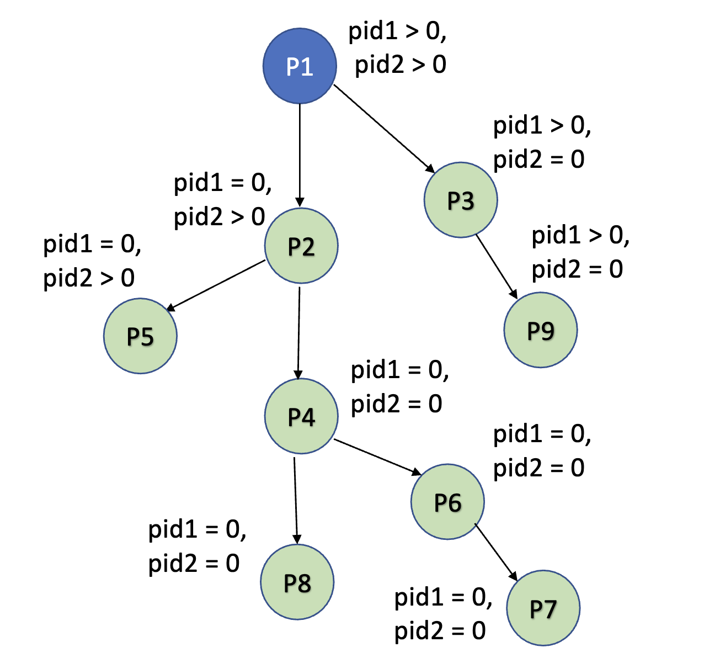

# Potential Questions for CS3SH3 Midterm 1

<!--toc:start-->

- [Chapter 6](#chapter-6)
  - [Dining philosopher](#dining-philosopher)
  - [Conditions for a solution to satisfy a CS Problem](#conditions-for-a-solution-to-satisfy-a-cs-problem)
  - [Explain by Peterson's solution is correct](#explain-by-petersons-solution-is-correct)
  - [Conditional Variables](#conditional-variables)
  - [Bounded Buffer Hypothetical Deadlock](#bounded-buffer-hypothetical-deadlock)
  - [Explain why interrupts are not appropriate for implementing synchronization primitives in multiprocessor systems.](#explain-why-interrupts-are-not-appropriate-for-implementing-synchronization-primitives-in-multiprocessor-systems)
  - [Memory Barrier Usage](#memory-barrier-usage)
  - [test_and_set(\*target) and compare_and_swap(\*value, expected, new_value)](#testandsettarget-and-compareandswapvalue-expected-newvalue)
- [Chapter 3](#chapter-3)
  - [IPC, Two Models and Where To Use One](#ipc-two-models-and-where-to-use-one)
  - [Draw the process tree](#draw-the-process-tree)
- [Chapter 4](#chapter-4)
  - [Give three examples of data parallelism and task parallelism each](#give-three-examples-of-data-parallelism-and-task-parallelism-each)
  - [Ahmdal's Law](#ahmdals-law)
  - [Performance Implications of different scenarios in a many-to-many Model](#performance-implications-of-different-scenarios-in-a-many-to-many-model)
  - [What is the output of the Line "xyz" - Thread based](#what-is-the-output-of-the-line-xyz-thread-based)
  <!--toc:end-->

## Chapter 6

### Dining philosopher

There are 5 philosophers sitting in a circle and alternate between thinking and eating. Each philosopher is a neighbour to other philosophers but they don't interact with each other.

There are 5 chopsticks and a bowl of rice (shared resource - assumed infinite for simplicity). Philosophers use the chopsticks and eat whenever they are not thinking.


The following code describes the process:-

```c
do {
    wait(chopstick[i]);  // Pick up the right chopstick
    wait (chopstick[(i + 1) % 5]); // Pick up the left chopstick

    // eat

    signal(chopstick[i]);
    signal(chopstick[(i + 1) % 5])
}
```

A potential problem in this code is that in the case all threads(philosophers) start executing(eating) at the same time at the same, they all might pick up the right chopstick since that's the first line of the code. However for a random philosopher someone's right chopstick could be their left chopstick since they are sitting in a circle. This would lead to a deadlock since each process(philosopher) is waiting for the other to release their right chopstick so that they can acquire it as their left chopstick and start eating.

There are three potential solutions for solving this problem:-

- At most only 4 philosophers are allowed to sit
- Asymmetric solution: Rewrite the code such that odd numbered philosopher picks left chopstick first whereas even numbered philosopher picks right chopstick first
- A philosopher is only allowed to pick up a chopstick if both chopsticks besides him are available. In the case that even one of the chopsticks (either right or left) is not available, he can't pick up any of them. We can simulate this behaviour by blocking the part of the code where we pick up chopsticks in a mutex lock. This ensures whenever some other philosophers are trying to acquire the chopsticks, the other philosophers can't access it at the same time.

### Conditions for a solution to satisfy a CS Problem

- **Mutual Exclusion**: If there are two processes $P_{\text{i}}$, the Critical Section can only be accessed by one and only one process at a time.
- **Progress**: Only those processes which is not executing in its remainder section must have an equal chance of entering its CS. The selection of process cannot arbitrarily be delayed indefinitely.
- **Bounded Waiting**: If a particular process is waiting to enter its CS, there must be a finite limit which allows other processes to enter their CS before the processes' request is granted.

### Explain by Peterson's solution is correct

- **Mutual Exclusion**: Even if both flags[0] and flags[1] are true at the same time, the turn variable is allocated the value of either 0 or 1 based on the order of execution. Since the while loop condition in the code is dependant on the latest value of turn, only one processes is allowed to enter it's critical section.
- **Progress**: Both processes have an equal chance of getting into their critical section. Even though both flags can be true at the same time, there is a random chance of turn to be 0 or 1 based on the order of execution. Additionally, the remainder section doesn't interfere with the selection of a process to go into its critical section. The selection of a process to go into its CS is done in finite time.
- **Bounded Waiting**: We know the variable turn determines which progress will go into its CS first. Let's assume both flags are true, depending on turn any process can go into its CS. Until its done executing, the other processes waits. After the process is done executing it sets its flag as false which allows the other process to go into its CS. Therefore each process waits for the other process to execute at most once.

### Conditional Variables

- Conditional Variables are only used in monitors unlike Semaphores which can be used anywhere.
- Monitors allow only process to run at a time. If let's say process Q was waiting on a condition (x.wait() where x is a conditional variable) and another process P released the wait by invoking x.signal(), since only one process can run at a time, based on the implementation of monitors, either P **signals and waits** i.e. it removes the wait from process Q and let's Q run until it leaves the monitor or waits on another conditional variable (let's say y - y.wait()). Another choice could be P **signals and continues** meaning it uplifts the wait on Q but makes it wait until it leaves the monitor or waits on another conditional variable (opposite of signal and wait). Don't get confused by the fact that they have to wait even though signaling has been done. Signaling uplifts a wait imposed by a conditional variable's wait() call. Whereas **signal and wait** and **signal and continue** is done in other to ensure no two processes can be executed at the same time.
- This is the key difference between Semaphores and Conditional Variables. Semaphores, don't necessarily always block the processes which call them since sometimes wait() can just reduce the value of a semaphore counter whereas conditional variables always block the processes that call them (.wait() and .signal() -> makes the decision either **signal and wait** or **signal and continue** ). You can think of semaphores being a counter for synchronization tasks whereas conditional variables operate solely based on certain conditions.
- If several processes are waiting on the same conditional variable x by invoking x.wait(), x.signal() wakes up a process based on First Come First Serve basis. Another option is to **conditional-wait** where we give a wait call with a priority. The lower the priority, the earlier the wakeup.

### Bounded Buffer Hypothetical Deadlock

The code of producer is as follows:-

```c
do {
...
/* produce an item in next_produced */
...
wait(empty);
wait(mutex);
...
/* add next produced to the buffer */
...
signal(mutex);
signal(full);
} while (true);
```

The code of consumer is as follows:-

```c
do {
wait(full);
wait(mutex);
/* remove an item from buffer to next_consumed */
signal(mutex);
signal(empty);
/* consume the item in next consumed */
} while (true);
```

**Question that can be asked**: What if we switch signal(empty) and signal(mutex) with each other? How will it impact the code?
If we switch the line signal(mutex) and signal(empty), it could potentially lead to a deadlock.
Switched code will be:-

```c
do {
/* produce an item in next_produced */
wait(mutex);
wait(empty);
/* add next produced to the buffer */
signal(mutex);
signal(full);
} while (true);
```

Imagine a scenario where the buffer is full i.e. empty = 0. In this case if our code acquires the mutex lock first, it will run into wait(empty). Since empty is 0, it just waits there and never releases the lock. The consumer process also can't do anything since it's waiting for the lock to be released in order to consume the buffer and due to the lock never releasing, it gets stuck in a deadlock.

### Explain why interrupts are not appropriate for implementing synchronization primitives in multiprocessor systems.

Interrupts are not atomic and also have a lot of overhead due to which it shouldn't be used to implement synchronization primitives

### Memory Barrier Usage

Memory barries are used because sometimes computers can reorder instructions which can cause discrepencies in our code.
One such situation is as follows:-

Thread 1:

```c
// Thread #1 is waiting in a loop until f becomes 1.
// Once f is set to 1, Thread #1 will exit the loop and print the value of x
while (f == 0);
print x;
```

Thread 2:

```c
// Thread #2 sets x = 42.
// Then, Thread #2 sets f = 1, signaling to Thread #1 that the value of x is ready to be read.
x = 42;
f = 1;
```

**Intended Behaviour**

- Thread 2 should first set the value of x and then set the value of f as 1 in order to break the loop in thread 1
- Thread 1 waits until f equals 1 and then reads the value of x.
- The expected result is that thread 1 prints 42, once f becomes 1.

**The Problem**

- If the instruction `x = 42` and `f = 1` gets reordered then f might become 1 before x is set to 42. If thread 1 executes immediately after f becomes 1 then it might print an incorrect value of x which was not intended.

Therefore a memory barrier is needed. The corrected code is as follows:-

Thread 1:

```c
while (f == 0);
memory_barrier();  // Ensures that f == 1 is fully observed before reading x
print x;           // Now reads the correct value of x (42)
```

Thread 2:

```c
x = 42;
memory_barrier();  // Ensures x = 42 is committed before f = 1
f = 1;
```

Memory barriers force any changes that you want up to the point its called to be forcefully propagated to all systems (like a github commit). So x = 42 will be known before f becomes 1.

### test_and_set(\*target) and compare_and_swap(\*value, expected, new_value)

test_and_set() returns the target's value but replaces it with true. This is useful for scenarios like the bounded buffer.

```c
bool test_and_set(bool *target) {
  bool old_val = *target;
  *target = true;
  return old_val
}
```

This is useful when we have to implement a mutex lock using the test_and_set() atomic hardware instruction. Assume that the following structure is available:-

```c
typedef struct {
bool held;
} lock;
```

`held == false (true)` indicates that the lock is available (not available) Using the `struct lock`, illustrate how the following functions can be implemented using the test_and_set() instructions:

- a. `void acquire(lock \*mutex)`
- b. `void release(lock \*mutex)`

```c
void acquire(lock *mutex) {
  while(test_and_set(&mutex->held));
  // Do whatever
}

void release(lock *mutex) {
  &mutex->held == false;
}
```

compare_and_swap() gives us more flexibility to do that. We don't have to stick to just using true to replace the target, we can be more flexible here.

```c
int compare_and_swap(int *value, int expected, int new_val) {
  int old_val = *value;
  if (*value == expected) {
    *value = new_val
  }

  return old_val;
}
```

We can simulate the same functionality as test_and_set using compare_and_swap by giving it appropriate values. The code for the same acquire and release is given below using compare_and_swap();

```c
void acquire(lock *mutex) {
  while(compare_and_swap(&mutex->held, false, true));
  // Do whatever
}

void release(lock *mutex) {
  &mutex->held == false;
}
```

## Chapter 3

### IPC, Two Models and Where To Use One

IPC stands for **Inter-Process Communication**. It refers to the mechanisms used by processes to exchange data and communicate with each other in an operating system. Since processes have separate memory spaces, they need IPC techniques to share information, coordinate their actions, or synchronize their behavior.

It has two models:-

- `Shared Memory`: Two or more processes communicate by accessing a common memory space. Processes can read or write to this memory area to exchange information.
- `Message Passing`: Processes communicate by sending and receiving messages, typically through the operating system. Difference between shared memory and message passing is that this model is simpler and safer (no need to worry about synchronization issues), but it may be slower than shared memory due to the overhead of message copying and system calls.

Shared memory is used when data has to be frequently transferred between processes without the overhead required for system calls. Typically in these cases a large amount of data is being transferred which is not very efficient using the message passing model.
Message Passing is useful when processes are loosely-coupled i.e. only need to exchange small messages. Additionally in certain systems where shared-memory isn't applicable (like distributed systems) message passing is the only option.

### Draw the process tree

**Example question** - Draw the process for the code given below and indicate pid1 and pid2 for each process created.

Code is as follows:-

```c
int main() {
    pid_t pid1, pid2;
    pid1 = fork();  // First fork
    pid2 = fork();  // Second fork

    if (pid1 == 0) {
        fork();     // Third fork
    }
    if (pid2 == 0) {
        fork();     // Fourth fork
    }

    return 0;
}
```

The process tree for the code above is as follows:-


Explanation

1. First fork() (pid1):
   - P1 creates P2.
   - Now we have two processes: P1 and P2.
2. Second fork() (pid2):
   - Both P1 and P2 execute this fork().

- P1 creates P3.
  - P2 creates P4.
  - Now we have four processes: P1, P2, P3, and P4.

3.  Third fork() (inside if (pid1 == 0)):
    - Only processes where pid1 == 0 (P2 and its descendants) execute this.
    - P2 creates P5.
    - P4 creates P6.
    - Now we have six processes: P1, P2, P3, P4, P5, and P6.
4.  Fourth fork() (inside if (pid2 == 0)):
    - Only processes where pid2 == 0 (P3 and P4) execute this.
    - P3 creates P9.
    - P4 creates P8.
    - Now we have nine processes: P1, P2, P3, P4, P5, P6, P8, and P9.

## Chapter 4

### Give three examples of data parallelism and task parallelism each

Data Parallelism:

- Matrix Multiplication: When multiplying two matrices, different rows or blocks of the matrices can be multiplied independently, as the operations on different rows do not depend on each other. Each processor handles a chunk of the matrix data.

- Image Processing: Applying a filter (e.g., blur, edge detection) to an image can be divided by splitting the image into smaller regions. Each region is processed independently by different processors.

- Adding values in an Array: In an array of size N, if we have to add all the values inside it, we can distribute them into the number of cores.

Task Parallelism:

- Web Server: A web server handling multiple client requests can assign different tasks (such as reading from a database, processing logic, or sending responses) to different threads or processors. Each task operates independently and can be processed in parallel.

- Video Game Rendering: Different aspects of rendering a video game, such as calculating physics, AI decision-making, and rendering the graphics, can be handled by separate threads, as these tasks do not need to be done sequentially.

- Editing word document: Different threads to interpret the keystrokes, display images, spelling and grammar, and perform automatic backups
  periodically.

### Ahmdal's Law

According to Amhdal's law, performance gain from increasing number of cores and making your application parallel is given by:-
$\cfrac{1}{S + \cfrac{1 - S}{N}}$

**An example question is**: Assume we have an application that is 70 percent parallel and 30 percent serial. If we
run this application on a system with 4 processing cores, what is the speed-up?

Answer would be $\cfrac{1}{0.3 + \cfrac{1 - 0.3}{4}}$ = $\cfrac{1 \times 4}{1.9}$ ~ 2.1 times faster

### Performance Implications of different scenarios in a many-to-many Model

Consider a multicore system and a multithreaded program written using the many-to-many threading model. Let the number of user-level threads in the program be greater than the number of processing cores in the system. Discuss the performance implications of the
following scenarios:

- The number of kernel threads allocated to the program is less than the number of processing cores.
- The number of kernel threads allocated to the program is equal to the number of processors.
- The number of kernel threads allocated to the program is greater than the number of processors.

**Answer**

- In the first case if the number of threads allocated are less than the number of processing cores, overall efficiency of the program will be worse due to the fact that core(s) will be underutilized. This may cause bottlenecks if the processing times are higher for some tasks which is unnecessary given the fact that few cores might be idle.
- In this case, each kernel thread can be scheduled on a separate processor which leads to full utilization of resources and maximizes parallel execution. Performance gains might be the highest in this case.
- The last case might be problematic due to the fact that the operating system has to context switch between the kernel threads to share processor time. Context switches come with a lot of overhead and no useful work is done which leads to poor performance and potential delays.

### What is the output of the Line "xyz" - Thread based

The program shown in Figure 4.16 (page 194 of the textbook) uses the Pthreads API. What would be the output from the program at LINE C and LINE P?

```c
#include <pthread.h>
#include <stdio.h>

int value = 0;
void *runner(void *param); /* the thread */

int main(int argc, char *argv[])
{
    pid_t pid;
    pthread_t tid;
    pthread_attr_t attr;

    pid = fork();

    if (pid == 0) { /* child process */
        pthread_attr_init(&attr);
        pthread_create(&tid, &attr, runner, NULL);
        pthread_join(tid, NULL);
        printf("CHILD: value = %d\n", value); /* LINE C */
    }
    else if (pid > 0) { /* parent process */
        wait(NULL);
        printf("PARENT: value = %d\n", value); /* LINE P */
    }
}

void *runner(void *param) {
    value = 5;
    pthread_exit(0);
}
```

Output of Line C would be **CHILD: value = 5** and Line P would be **PARENT: value = 0**. The reason is as follows:-

- When a child process is created, it gets its own memory space and all data from the parent is copied to the memory space.
- Initially the child has the value set as 0 which gets changed when the thread function is called by the thread created in the child process.
- The thread can only access the memory space of the process it was created in which is the child process' memory space. The value gets changed to 5 in the child process and gets printed since the thread gets collected using `pthread_join()` before the print statement.
- In the parent process code the value gets printed as 0 since previously the value was changed only in the child process' memory space. As we said before, the parent process has a different memory space, therefore, the value remains unchanged i.e. 0.
