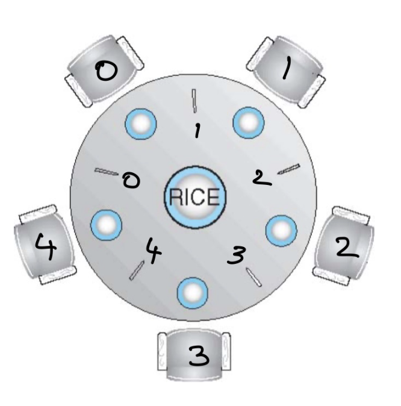

# Potential Question for CS3SH3 Midterm 1

## Chapter 3

### Draw the process tree

**Example question** - Draw the process for the code given below and indicate pid1 and pid2 for each process created.

Code is as follows:-

```c
int main() {
    pid_t pid1, pid2;
    pid1 = fork();  // First fork
    pid2 = fork();  // Second fork

    if (pid1 == 0) {
        fork();     // Third fork
    }
    if (pid2 == 0) {
        fork();     // Fourth fork
    }

    return 0;
}
```

The process tree for the code above is as follows:-


Explanation

1. First fork() (pid1):
   - P1 creates P2.
   - Now we have two processes: P1 and P2.
2. Second fork() (pid2):
   - Both P1 and P2 execute this fork().

- P1 creates P3.
  - P2 creates P4.
  - Now we have four processes: P1, P2, P3, and P4.

3.  Third fork() (inside if (pid1 == 0)):
    - Only processes where pid1 == 0 (P2 and its descendants) execute this.
    - P2 creates P5.
    - P4 creates P6.
    - Now we have six processes: P1, P2, P3, P4, P5, and P6.
4.  Fourth fork() (inside if (pid2 == 0)):
    - Only processes where pid2 == 0 (P3 and P4) execute this.
    - P3 creates P9.
    - P4 creates P8.
    - Now we have nine processes: P1, P2, P3, P4, P5, P6, P8, and P9.

## Chapter 6

### Dining philosopher

There are 5 philosophers sitting in a circle and alternate between thinking and eating. Each philosopher is a neighbour to other philosophers but they don't interact with each other.

There are 5 chopsticks and a bowl of rice (shared resource - assumed infinite for simplicity). Philosophers use the chopsticks and eat whenever they are not thinking.



The following code describes the process:-

```c
do {
    wait(chopstick[i]);  // Pick up the right chopstick
    wait (chopstick[(i + 1) % 5]); // Pick up the left chopstick

    // eat

    signal(chopstick[i]);
    signal(chopstick[(i + 1) % 5])
}
```

A potential problem in this code is that in the case all threads(philosophers) start executing(eating) at the same time at the same, they all might pick up the right chopstick since that's the first line of the code. However for a random philosopher someone's right chopstick could be their left chopstick since they are sitting in a circle. This would lead to a deadlock since each process(philosopher) is waiting for the other to release their right chopstick so that they can acquire it as their left chopstick and start eating.

There are three potential solutions for solving this problem:-

- At most only 4 philosophers are allowed to sit
- Asymmetric solution: Rewrite the code such that odd numbered philosopher picks left chopstick first whereas even numbered philosopher picks right chopstick first
- A philosopher is only allowed to pick up a chopstick if both chopsticks besides him are available. In the case that even one of the chopsticks (either right or left) is not available, he can't pick up any of them. We can simulate this behaviour by blocking the part of the code where we pick up chopsticks in a mutex lock. This ensures whenever some other philosophers are trying to acquire the chopsticks, the other philosophers can't access it at the same time.

### Conditions for a solution to satisfy a CS Problem

- **Mutual Exclusion**: If there are two processes $P_{\text{i}}$, the Critical Section can only be accessed by one and only one process at a time.
- **Progress**: Only those processes which is not executing in its remainder section must have an equal chance of entering its CS. The selection of process cannot arbitrarily be delayed indefinitely.
- **Bounded Waiting**: If a particular process is waiting to enter its CS, there must be a finite limit which allows other processes to enter their CS before the processes' request is granted.

### Explain by Peterson's solution is correct

- **Mutual Exclusion**: Even if both flags[0] and flags[1] are true at the same time, the turn variable is allocated the value of either 0 or 1 based on the order of execution. Since the while loop condition in the code is dependant on the latest value of turn, only one processes is allowed to enter it's critical section.
- **Progress**: Both processes have an equal chance of getting into their critical section. Even though both flags can be true at the same time, there is a random chance of turn to be 0 or 1 based on the order of execution. Additionally, the remainder section doesn't interfere with the selection of a process to go into its critical section. The selection of a process to go into its CS is done in finite time.
- **Bounded Waiting**: We know the variable turn determines which progress will go into its CS first. Let's assume both flags are true, depending on turn any process can go into its CS. Until its done executing, the other processes waits. After the process is done executing it sets its flag as false which allows the other process to go into its CS. Therefore each process waits for the other process to execute at most once.

### Conditional Variables

- Conditional Variables are only used in monitors unlike Semaphores which can be used anywhere.
- Monitors allow only process to run at a time. If let's say process Q was waiting on a condition (x.wait() where x is a conditional variable) and another process P released the wait by invoking x.signal(), since only one process can run at a time, based on the implementation of monitors, either P **signals and waits** i.e. it removes the wait from process Q and let's Q run until it leaves the monitor or waits on another conditional variable (let's say y - y.wait()). Another choice could be P **signals and continues** meaning it uplifts the wait on Q but makes it wait until it leaves the monitor or waits on another conditional variable (opposite of signal and wait). Don't get confused by the fact that they have to wait even though signaling has been done. Signaling uplifts a wait imposed by a conditional variable's wait() call. Whereas **signal and wait** and **signal and continue** is done in other to ensure no two processes can be executed at the same time.
- This is the key difference between Semaphores and Conditional Variables. Semaphores, don't necessarily always block the processes which call them since sometimes wait() can just reduce the value of a semaphore counter whereas conditional variables always block the processes that call them (.wait() and .signal() -> makes the decision either **signal and wait** or **signal and continue** ). You can think of semaphores being a counter for synchronization tasks whereas conditional variables operate solely based on certain conditions.
- If several processes are waiting on the same conditional variable x by invoking x.wait(), x.signal() wakes up a process based on First Come First Serve basis. Another option is to **conditional-wait** where we give a wait call with a priority. The lower the priority, the earlier the wakeup.

### Bounded Buffer Hypothetical Deadlock

The code of producer is as follows:-

```c
do {
...
/* produce an item in next_produced */
...
wait(empty);
wait(mutex);
...
/* add next produced to the buffer */
...
signal(mutex);
signal(full);
} while (true);
```

The code of consumer is as follows:-

```c
do {
wait(full);
wait(mutex);
/* remove an item from buffer to next_consumed */
signal(mutex);
signal(empty);
/* consume the item in next consumed */
} while (true);
```

**Question that can be asked**: What if we switch signal(empty) and signal(mutex) with each other? How will it impact the code?
If we switch the line signal(mutex) and signal(empty), it could potentially lead to a deadlock.
Switched code will be:-

```c
do {
/* produce an item in next_produced */
wait(mutex);
wait(empty);
/* add next produced to the buffer */
signal(mutex);
signal(full);
} while (true);
```

Imagine a scenario where the buffer is full i.e. empty = 0. In this case if our code acquires the mutex lock first, it will run into wait(empty). Since empty is 0, it just waits there and never releases the lock. The consumer process also can't do anything since it's waiting for the lock to be released in order to consume the buffer and due to the lock never releasing, it gets stuck in a deadlock.
